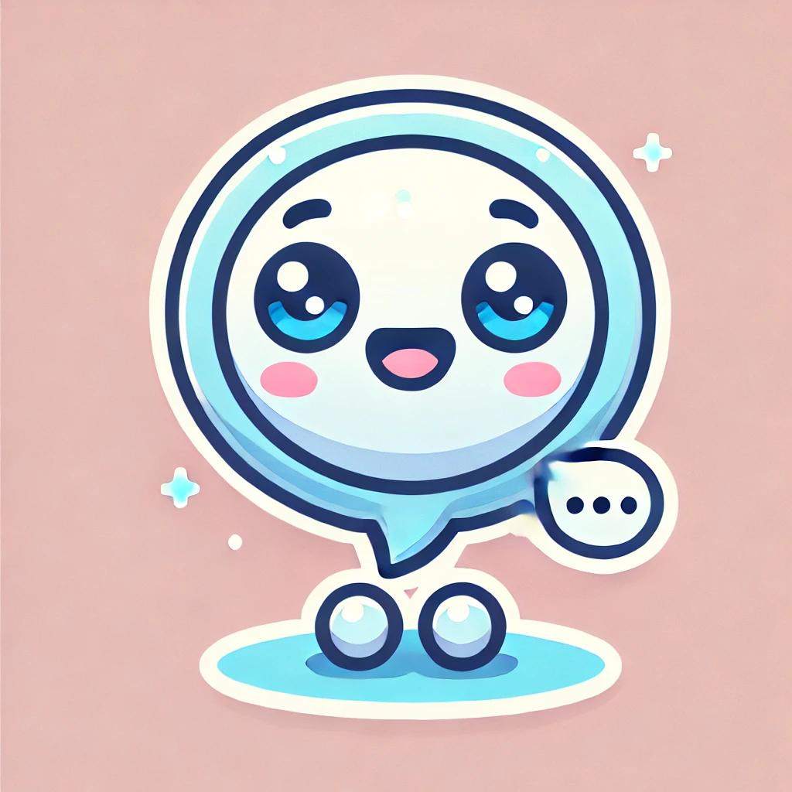

# ✨ Lumi - Your AI Companion 💙

  

Lumi is an AI-powered chatbot designed to **listen, understand, and support** your emotions.  
Whether you're feeling happy, sad, or just need someone to talk to, **Lumi is here for you**. 🤗  


---

## 🌟 Features
- ✅ **Emotion Detection** – Lumi understands your emotions based on your text.  
- ✅ **Empathetic Responses** – Lumi communicates with warmth and care.
- ✅ **FastAPI Backend** – Utilizes the **bhadresh-savani/bert-base-go-emotion** model, fine-tuned on the **GoEmotions dataset** for precise emotion detection.  
- ✅ **Streamlit UI** – Simple and user-friendly interface.  
- ✅ **Google Dialogflow Integration** – Lumi is integrated with **Google Dialogflow** for conversational AI capabilities.  
- ✅ **Live Deployment** – Hosted on **Render & Hugging Face Spaces** for easy access.  

---

## 🚀 Live Demo
🔗 **Try Lumi Now →** [Lumi Chatbot on Hugging Face](https://Yuki-Chen-emochatbot.hf.space/dialogflow)  

---

## 📌 How to Use Lumi
1. **Type a message** in the chatbox (e.g., *"I feel so excited today! 🎉"*)  
2. **Click "💡 Share with Lumi"**  
3. **Lumi will analyze your emotions and respond empathetically** 💙  
4. **Use Lumi with Google Dialogflow for deeper AI conversations.**  

---

## 🛠️ Setup & Installation

### **1⃣ Clone the Repository**
```bash
git clone https://github.com/ycyukichen/Lumi-Chatbot.git
cd Lumi-Chatbot
```

### **2⃣ Install Dependencies**
```bash
pip install -r requirements.txt
```

### **3⃣ Run Lumi Locally**
```bash
streamlit run app.py
```
Lumi will now be available at **`http://localhost:8501`** 🎉

---

## 🛠️ Tech Stack
- 🔹 **Streamlit** – UI framework
- 🔹 **FastAPI** – Backend API
- 🔹 **Hugging Face Transformers** – Emotion Detection engine
- 🔹 **GoEmotions dataset** – Training data for emotion recognition
- 🔹 **Google Dialogflow** – Conversational AI integration  
- 🔹 **Render & Hugging Face Spaces** – Deployment  

---

## 🔍 More Information

- **Model Details**: Fine-tuned BERT-based model trained on the GoEmotions dataset for precise emotion recognition
- **Performance**: Accurately identifies joy, sadness, fear, anger, surprise, and more
- **Integration**: Seamlessly connects with Google Dialogflow for enhanced conversation flow

---

## 🐝 License
This project is licensed under the **MIT License**. Feel free to use, modify, and share.  


